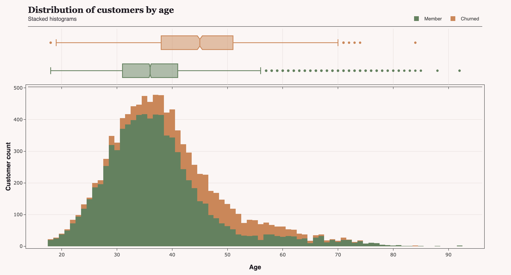

# Bank customer churn analysis

## Description

This analysis uses the [Bank Customer Churn dataset](https://mavenanalytics.io/data-playground/bank-customer-churn) by [Maven Analytics](https://mavenanalytics.io/). Accessed July 29, 2026.

Data contains information for around 10,000 bank accounts at a European bank. Variables include account balance, customer age, gender and tenure, credit card usage, outcome, among others. The main objective of this analysis is to highlight potential causes for customer churn.

## Setup

<b>Note:</b> This requires uv to be installed.

First, create an `.env` file with the path to the data itself:

`DATA_FILEPATH="path/to/bank/customer/churn/data"`

Afterwards, dependencies can be installed locally with:

`make venv`

Running `make jupyter` will initialize a local Jupyter Lab instance, from which the main analysis, `bank_churn_analysis.ipynb`, can be run.

<b>Note:</b> charts are rendered as PNG images by default for the purposes of having a preview in the repository. Changing `RENDER_AS_PNG` in the first cell to False will show interactive charts.

## Methodology

The analysis includes the following steps:

### Import and clean data

This involves cleaning country information, mapping currency related columns to integers and binary columns (Yes / No or 0 / 1) to booleans.

### Exploration of how distributions differ between account outcomes

Since there is a small amount of account factors, we manually visualize how each account factor's distributions differ.

### Finding potential churn causes

Two models, Random Forest and XGBoost Classifier, were trained to predict churn outcome. We then extract feature importance and compare with a correlation matrix. Common highlighted features are described in the `Conclusions` section.

Parameter search was performed by way of a grid search, and models were evaluated using accuracy, since there are only 2 possible outcomes.

### Clustering methods for customer segmentation

An exploration of clustering on both the raw and dimension reduced dataset (by way of PCA) using Spectral Clustering.

We rely on the [Hopkins statistic](https://en.wikipedia.org/wiki/Hopkins_statistic) to quantify cluster tendency and highlight potential feature combinations. Since this method is stochastic (as it involves random samples), it is calculated multiple times and then averaged out.

## Conclusions

Keeping in mind the recommended analysis by Maven Analytics, we have the following takeaways:
 - Our approaches to establish possible connections between each variable and account outcome (manual visualization, correlation matrix, classification), highlighted different possible attributes to churned accounts, but amongst them, **age was by far the most common potential cause**. Other common attributes include the country of the client (specifically if it's Germany), as well as account balance, activity and total products.
    - The data has a considerable class inbalance between current members and churned customers. This makes it so that classification based approaches will likely end up with a high amount of false negatives on the smaller class (churn). Some adjustments could be implemented on the preprocessing side, such as removing entries from the current member class, but it could be problematic given the small customer set;
    - XGBoost Classifiers and Random Forest models were tested as machine learning approaches for outcome prediction, but their accuracies were very close (both at around 86%), even though their most relevant features for prediction differed considerably (out of the top 5 "important" features, only 2 were common: age and total products);
 - **Customers in Germany register the highest churn rate**, despite making roughly a quarter of the entire data. On the other hand, Spain, also making up nearly 25% of data, registers the lowest churn rate.
    - Germany is also the country that does not register small balances, an aspect also captured by clustering approaches.
  

## Technologies Used

The following stack was used:
 - `polars` (data manipulation);
 - `plotly` (visualization);
 - `scikit-learn` (Random Forest for churn prediction, PCA, clustering, general Machine Learning methods);
 - `xgboost` (XGBoost Classifier for churn prediction).

Finally, [quoi](https://github.com/jojustleft/quoi) is the toolkit used in order to streamline common analysis steps.
